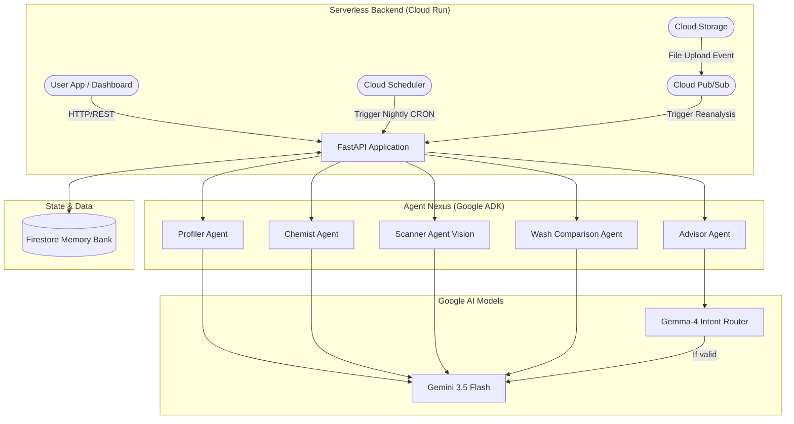

# 🧪 Curl Chemist: The Autonomous Haircare Scientist

> **Submission for the #AllThingsAgentic Hackathon**
> **Category:** 🏆 The Taskmaster
> **Bonus Points claimed:** Gemma 3 Integration (Intent Router)

## 🌪️ The Friction (Bring Your Own Friction - BYOF)
Managing curly hair is a chemistry nightmare. It requires tracking product ingredients (sulfates, silicones, proteins, humectants), understanding how they interact with each other (e.g., using heavy silicones without a clarifying sulfate shampoo leads to buildup), and adjusting for daily climate conditions (dew point, humidity, UV index). 

Humans cannot memorize cosmetic chemistry and daily meteorological data. The current "solution" involves messy spreadsheets, hours of Googling ingredients, and trial-and-error that ruins hair.

## 🪄 The Agentic Solution
**Curl Chemist is a fully autonomous background workflow engine, not just a chatbot.** 

Instead of waiting for a user to ask questions, Curl Chemist acts as a true **Taskmaster**:
1. **Event-Driven Intake:** You upload a photo of a product label. Cloud Storage triggers Pub/Sub, waking up the **Scanner Agent (Gemini 3.5 Vision)** to extract ingredients and save them to your digital shelf.
2. **N×N Conflict Resolution:** The **Chemist Agent** runs autonomously, cross-referencing your entire shelf against a cosmetic chemistry rulebook. If it detects you bought a protein treatment but already have 3 protein products, it logs a "Protein Overload" alert.
3. **Asynchronous Execution:** Every night at 9 PM, **Cloud Scheduler** triggers the **Nightly Routine Pipeline**. The agent fetches tomorrow's weather (via Open-Meteo geocoding API) and formulates a specific wash/style routine from your shelf.
4. **Fast & Cheap Routing:** The **Advisor Agent** uses **Gemma-4** as an ultra-fast intent router to filter out off-topic questions before routing valid hair queries to the more expensive Gemini 3.5 model.

---

## 🏗️ Architecture & Tech Stack

### 🧠 Google AI Integration
*   **Gemini 3.5 Flash:** Core reasoning, vision-based label extraction, routine formulation, and personalized conflict explanations.
*   **Gemma-4 (Bonus):** Implemented as a pre-filter/intent router in the `Advisor Agent`. It categorizes user prompts and blocks off-topic queries, saving latency and Gemini tokens.
*   **Google ADK:** Agent orchestration and tool binding.

### ☁️ Google Cloud Infrastructure
*   **Cloud Run:** Serverless, scalable backend hosting the FastAPI application.
*   **Firestore:** The "Memory Bank". Persists user profiles, product shelf state, conflict matrices, and historical wash data across sessions.
*   **Cloud Storage:** Securely stores wash-day selfies and product label photos.
*   **Cloud Pub/Sub:** Event-driven architecture. Triggers shelf reanalysis pipelines the moment a new product photo hits the bucket.
*   **Cloud Scheduler:** Cron jobs triggering the nightly routine generator and weekly health report pipelines in the background.

### 🗺️ System Diagram



---

## 🚀 Spin-up & Deployment Instructions

### Prerequisites
1. Python 3.10+
2. Google Cloud CLI (`gcloud`) installed and authenticated
3. A Google Cloud Project with Billing enabled

### Local Setup (Reproducibility)
1. **Clone and Install:**
   ```bash
   git clone https://github.com/your-username/curl-chemist.git
   cd curl-chemist
   python -m venv venv
   source venv/bin/activate  # On Windows: venv\Scripts\activate
   pip install -r requirements.txt
   ```

2. **Environment Variables:**
   Create a `.env` file in the root directory:
   ```env
   GCP_PROJECT_ID=your-project-id
   GCP_REGION=us-central1
   GEMINI_MODEL=gemini-3.5-flash
   GEMMA_MODEL=gemma-4-26b-a4b-it
   # Optional: If not running via Vertex AI on GCP, provide API key
   GEMINI_API_KEY=your_api_key_here
   PHOTOS_BUCKET=your-gcs-bucket-name
   ```

3. **Run Locally:**
   ```bash
   uvicorn main:app --reload --port 8080
   ```
   Visit `http://localhost:8080` to access the dashboard.

### Cloud Deployment (Google Cloud Run)
1. **Create the Storage Bucket:**
   ```bash
   gcloud storage buckets create gs://your-gcs-bucket-name --location=us-central1
   ```
2. **Deploy to Cloud Run via Cloud Build:**
   ```bash
   gcloud builds submit --tag gcr.io/your-project-id/curl-chemist
   gcloud run deploy curl-chemist \
       --image gcr.io/your-project-id/curl-chemist \
       --platform managed \
       --region us-central1 \
       --allow-unauthenticated \
       --no-cpu-throttling \
       --set-env-vars GCP_PROJECT_ID=your-project-id,PHOTOS_BUCKET=your-gcs-bucket-name
   ```

3. **Set up Cloud Scheduler for Nightly Pipeline:**
   ```bash
   gcloud scheduler jobs create http nightly-routine \
       --schedule="0 21 * * *" \
       --time-zone="Africa/Cairo" \
       --uri="https://YOUR_CLOUD_RUN_URL/pipelines/nightly/run-all" \
       --http-method=POST \
       --oidc-service-account-email="YOUR_SERVICE_ACCOUNT_EMAIL" \
       --location=us-central1
   ```

---

## 📺 Demonstration
**[Link to 4-minute YouTube Demo Video]** *(Replace with actual link before submission)*

*The video demonstrates the complete workflow, including terminal logs of the background agent execution, Firestore database updates, and visual proof of the Google Cloud Run and Scheduler deployments.*

---
**Built for the #AllThingsAgentic Hackathon** 🚀
